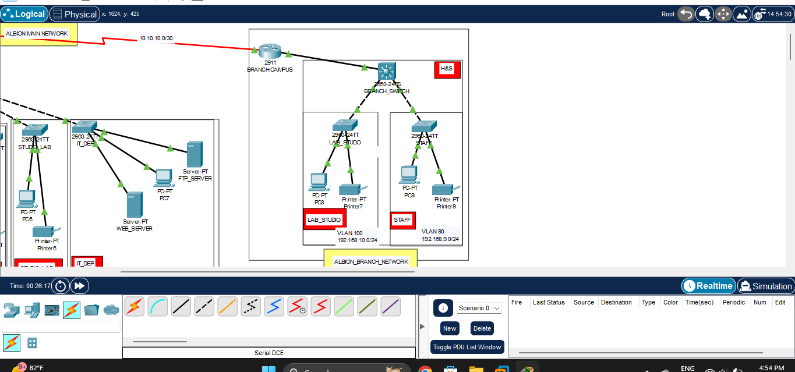

|  | This project is a simulation of a company network built using Cisco Packet Tracer. It includes both a main campus and a branch network connected through a routed link. I configured multiple VLANs to logically separate departments such as ADMIN, HR, FINANCE, BUSINESS, IT, and others. Each department has its own switch, PCs, printers, and in some cases, servers like FTP and web servers. The network uses subnetting to assign each VLAN a dedicated IP range, which improves organization and enhances security. |
|   | In the main campus network, different buildings (A, B, and C) are mapped to their own VLANs and departments. For example, VLAN 10 is for ADMIN in Building A with the subnet 192.168.1.0/24, and VLAN 80 is for IT in Building C with the subnet 192.168.8.0/24. The network uses a Layer 3 switch to handle inter-VLAN routing, allowing communication between different departments while keeping their traffic isolated                                                                                                   |
|   | The branch network is part of the same organization but located remotely. It connects to the main network over the 10.10.10.0/30 network. The branch also includes VLANs for departments like LAB and STAFF, each with their own subnet and switches, maintaining the same structure as the main network.                                                                                                                                                                                                                    |
|     | The image highlights the CLI configuration of a switch where I created VLAN 10 and assigned ports to it in access mode. The network is logically divided into different departments, each with its own devices connected to dedicated switches. The configuration demonstrate assign interfaces, and use basic Cisco IOS commands to build functional network topologies.                                                                                                                                                    |
